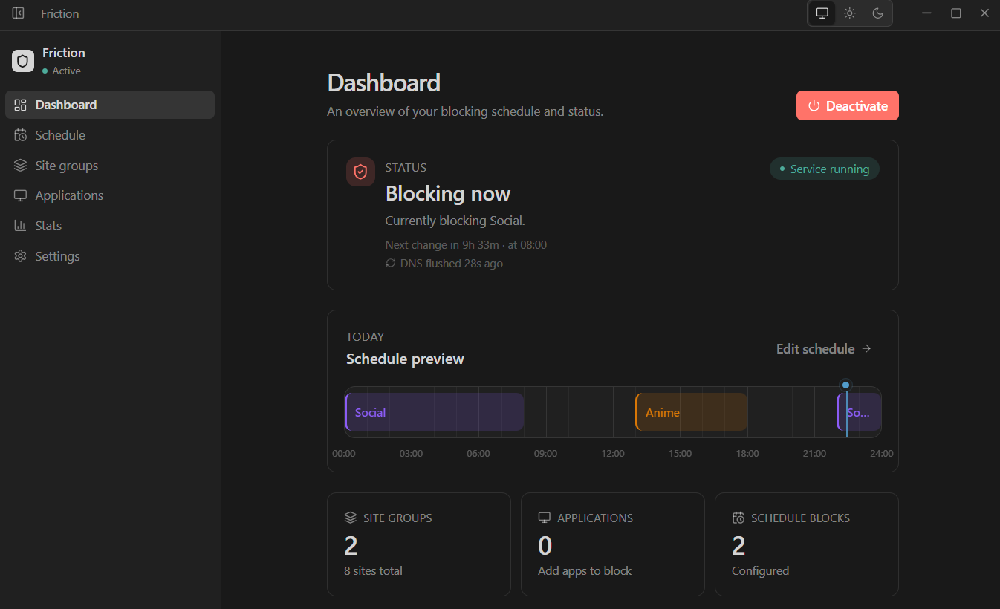
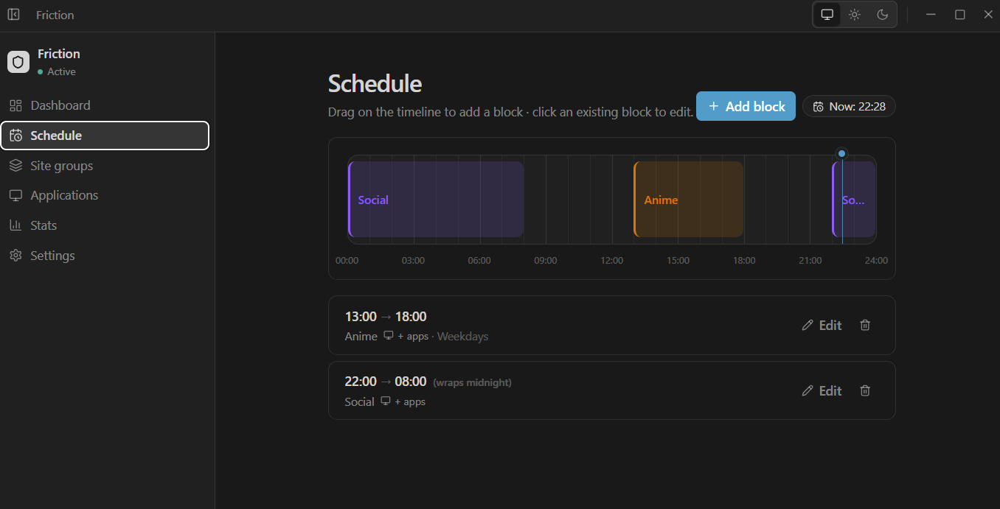
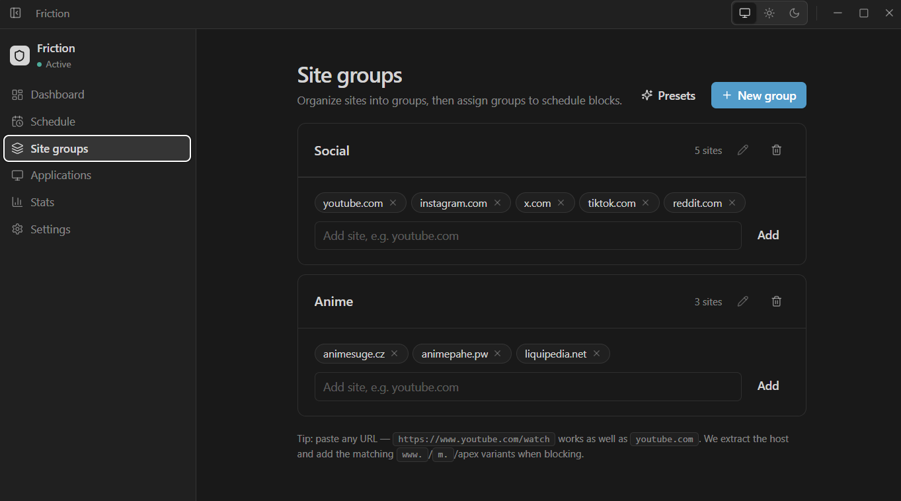
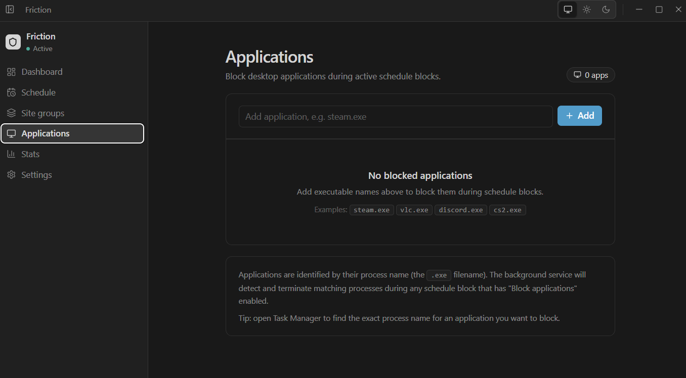

# Friction

<div align="center">


**μ = ∞**

*An OS-level focus system that creates friction against distractions.*

[](#installation)
[](#license)

</div>

---

## Screenshots

<table>
  <tr>
    <td align="center"><b>Dashboard</b></td>
    <td align="center"><b>Website Blocking</b></td>
  </tr>
  <tr>
    <td></td>
    <td></td>
  </tr>
  <tr>
    <td align="center"><b>Schedule Management</b></td>
    <td align="center"><b>Application Blocking</b></td>
  </tr>
  <tr>
    <td></td>
    <td></td>
  </tr>
</table>

---

## What is Friction?

Most productivity apps try to help you **focus**.

Friction makes **distraction harder**.

Instead of relying on willpower, Friction changes your environment:

- **Block websites** — YouTube, Twitter, Reddit, and more
- **Block applications** — games, streaming apps, social media
- **Schedule enforcement** — automatic time-based blocking windows
- **Background service** — blocking continues even when the app is closed
- **Hard mode** — configurable friction against deactivation (confirm dialog, cooldown, typed phrase)

When a distraction becomes harder than the work, focus becomes the default.

The name comes from the idea: **μ = ∞** — infinite friction against distractions.

---

## Features

| Category | Feature |
|----------|---------|
| **Blocking** | Website blocking via hosts file |
| | Application blocking via process termination |
| | Schedule-based automatic enforcement |
| **Service** | Background Windows Service (survives app close) |
| | One-time UAC admin prompt during install |
| | Auto-start on boot |
| **Configuration** | Site groups with presets |
| | Custom schedule blocks per day |
| | Per-block app blocking toggle |
| | Light / Medium / Hard / Extreme deactivation friction |
| **Privacy** | 100% local — no accounts, no cloud, no analytics |

---

## How It Works

```text
┌──────────────┐
│  Electron UI │  ← Configure schedules, groups, preferences
└──────┬───────┘
       │ config.json changes
       ▼
┌──────────────────┐
│ Windows Service  │  ← Runs as LocalSystem, starts on boot
└──────┬───────────┘
       │ evaluates schedule every 60s, apps every 5s
       ▼
┌──────────────────┐
│  Schedule Engine │  ← Determines what should be blocked right now
└──────┬───────────┘
       │
       ▼
┌───────────────┬──────────────────┐
│ Hosts Writer  │  Process Blocker │
│ (website DNS) │  (app killing)   │
└───────────────┴──────────────────┘
```

- **Hosts Writer** redirects blocked domains to `127.0.0.1`
- **Process Blocker** terminates blocked `.exe` processes every 5 seconds
- The schedule engine ticks every 60 seconds for full re-evaluation
- All blocking stops when deactivated or outside a schedule window

---

## Example Use Cases

### Deep Work

```text
9:00 AM → 1:00 PM  ·  Weekdays

Block:  YouTube, Twitter, Reddit, Steam, VLC
```

### Study Session

```text
6:00 PM → 9:00 PM  ·  Every day

Block:  Games, anime sites, video players
```

### Work Hours

```text
10:00 AM → 6:00 PM  ·  Mon–Fri

Block:  Social media, entertainment sites
```

---

## Installation

### Windows

1. Download the latest installer from [GitHub Releases](https://github.com/tanmaychavan/friction/releases)
2. Run the installer
3. Approve the **one-time** administrator prompt to install the background service
4. After installation:
   - The background service starts automatically
   - Friction launches normally
   - No repeated admin prompts

### macOS & Linux

Coming soon.

---

## Development

### Prerequisites

- Node.js 18+
- npm 9+

### Setup

```bash
git clone https://github.com/tanmaychavan/friction.git
cd friction
npm install
```

### Commands

| Command | Description |
|---------|-------------|
| `npm run dev` | Start dev server with hot reload |
| `npm run build` | Type-check + Vite production build |
| `npm run transpile:electron` | Compile Electron main process |
| `npm run dist:win` | Package Windows installer |

### Architecture

```text
src/
├── electron/          # Main process (IPC, config, tray, service management)
├── service/           # Windows Service runtime (hosts writer, process blocker, scheduler)
├── shared/            # Shared types, constants, schema, schedule engine
└── ui/                # React renderer (pages, components, hooks)
    ├── components/    # Reusable UI components
    ├── hooks/         # React hooks (config, stats, milestone, theme)
    ├── lib/           # Shared utilities (format, version)
    └── pages/         # Page components (Dashboard, Schedule, Groups, Apps, Stats, Settings)
```

---

## Privacy

Friction is completely local.

- No accounts
- No cloud sync
- No analytics
- No data collection

Your schedules and blocking rules remain on your machine.

---

## Contributing

Pull requests are welcome. Areas for contribution:

- Cross-platform support (macOS, Linux)
- New blocking mechanisms
- UI improvements
- Performance improvements
- Testing & CI

---

## License

[MIT](LICENSE)
